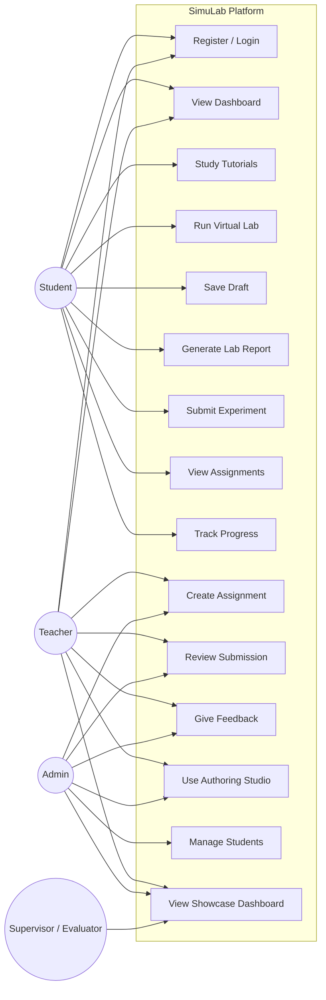
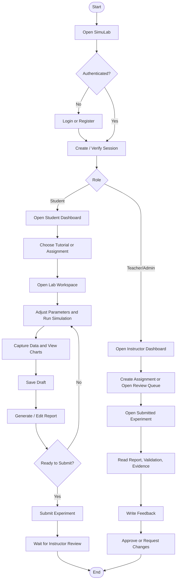
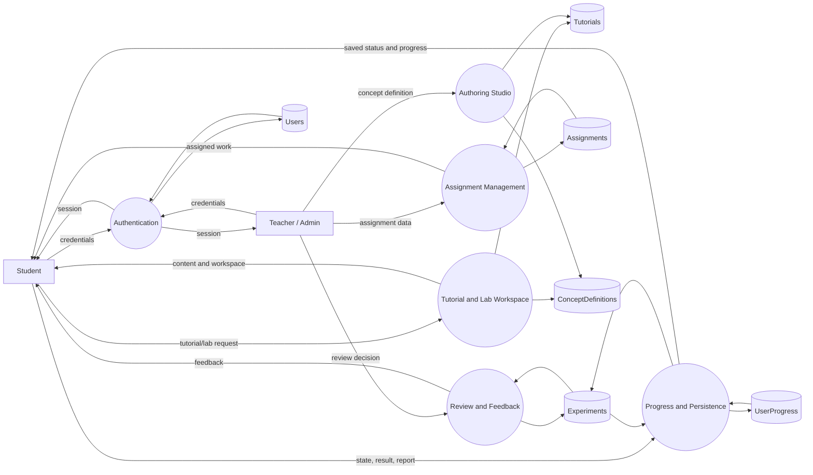
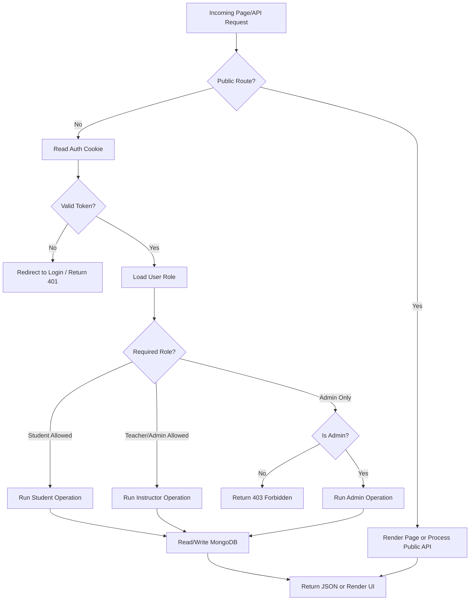
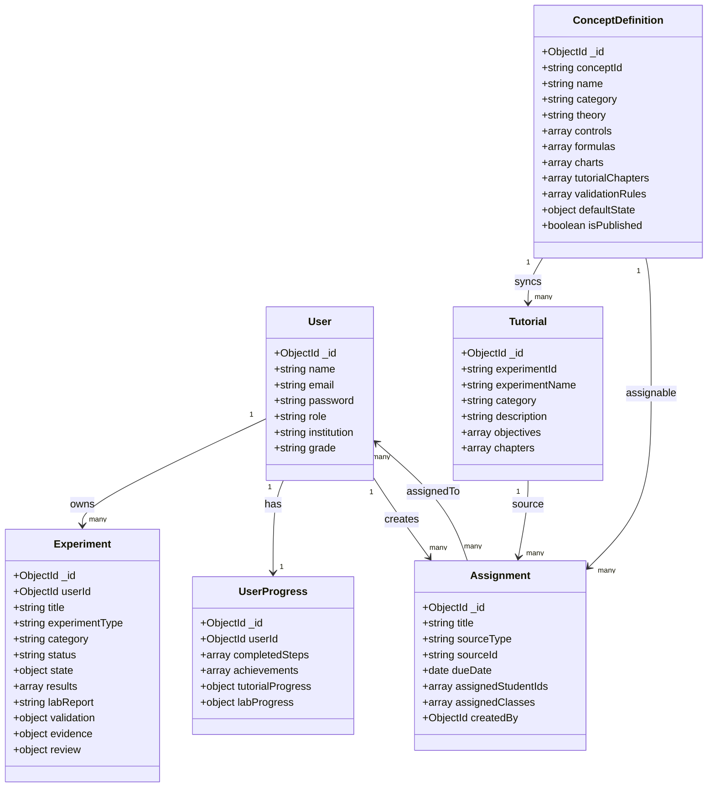
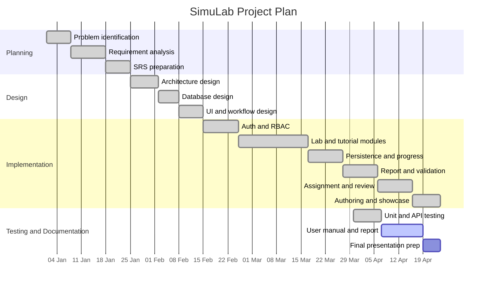
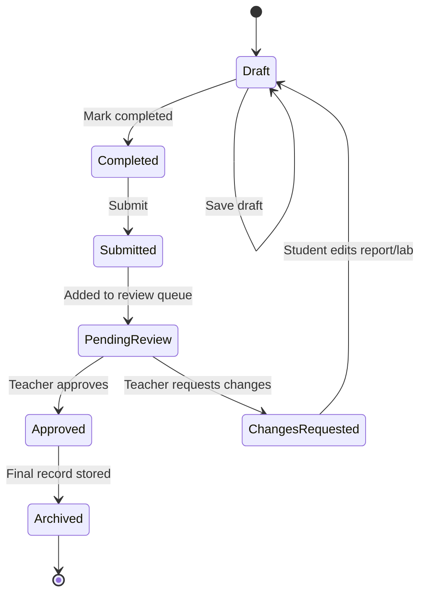
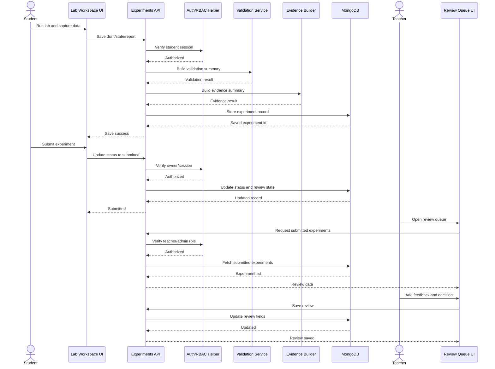

# SimuLab Diagram Mermaid Source

Use Mermaid Live Editor, Mermaid CLI, or a Markdown editor with Mermaid support to render these diagrams. Export each as PNG or SVG and insert it into the matching LaTeX figure placeholder.

## 1. Use Case Diagram

## 2. Activity Diagram

## 3. DFD - Level 1

## 4. Control Flow Diagram

## 5. Class Diagram

## 6. Gantt Chart

## 7. State Diagram

## 8. Sequence Diagram

